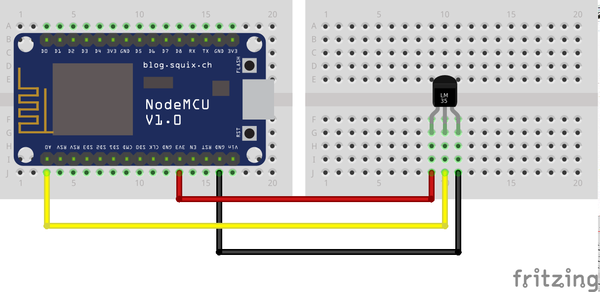

# wm-example-esp8266

Example using ESP8266 to send data to [Wireless Monitor](https://github.com/sanusb-grupo/wireless-monitor)
configured to monitor a Temperature sensor, Texas Instruments' LM35.

## Getting Started

Edit your Wi-Fi configuration at:

```c
const char* ssid = "";
const char* password = "";
```

Edit Wireless Monitor configuration. For that you need a server running.

```c
const String host = "";
const int port = 80;
const String api_key = "";
const String monitor_key = "";
```

## Compiling and running in Arduino IDE

<https://github.com/esp8266/Arduino#installing-with-boards-manager>

## Software Dependencies

* [ESP8266WiFi](https://github.com/esp8266/Arduino/tree/master/libraries/ESP8266WiFi)
* [ESP8266HTTPClient](https://github.com/esp8266/Arduino/tree/master/libraries/ESP8266HTTPClient)
* [ArduinoJson](https://bblanchon.github.io/ArduinoJson)

After install Additional Board Manager all these dependencies will be available
to download.

## Hardware Dependencies

* [NodeMCU ESP8266-12E](http://www.dx.com/p/nodemcu-lua-esp8266-wi-fi-development-board-black-436861)
* [Texas Instruments' LM35](http://www.dx.com/p/lm35dz-lm35-to-92-high-precision-temperature-sensor-ic-inductor-436038)

## References

* <https://github.com/esp8266/Arduino>
* <https://diyprojects.io/esp8266-web-client-tcp-ip-communication-examples-esp8266wifi-esp866httpclient>
* <https://techtutorialsx.com/2016/07/21/esp8266-post-requests>
* <https://bblanchon.github.io/ArduinoJson>

## Assembling


